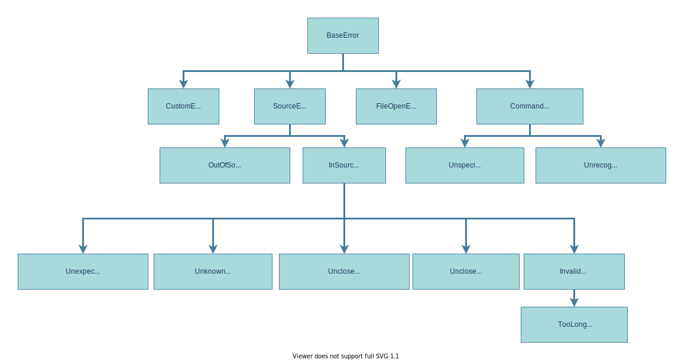

# SaltC errors

## Basic usage of errors
SaltC errors classes were created to use with [`eprint`]() macro function provided by
    [logging module]() which prints out an error message based on provided parameters and choosen class of error and than closing compiler after it in most safety and easy-to-use possible way.

To use error with logging module you will need to include two saltc header files:
+ [`logging.h`]()
+ [`error.h`]()

### **Example usage of eprint and any error class.**
```cpp
eprint(new AnyErrorClass(error_parameters...));
```

How you can see it's needed to pass **pointer to error class object** to throw it,
    but it's fully safe because when you calling [`eprint`]() it's cleans that pointer at the moment before closing program.<br>
    So you may not carry about pointer passed to [`eprint`]() and storing it. That's why I used `new` C++ keyword here.


## Error classes


### **Index**
+ [BaseError](./errors/BaseError.md)
+ [FileOpenError](./errors/FileOpenError.md)
+ [CommandLineError](./errors/CommandLineError.md)
+ [UnspecifiedMainError](./errors/UnspecifiedMainError.md)
+ [UnrecognizedOptionError](./errors/UnrecognizedOptionError.md)
+ [SourceError](./errors/SourceError.md)
+ [OutOfSourceRangeError](./errors/OutOfSourceRangeError.md)
+ [InSourceError](./errors/InSourceError.md)
+ [UnexpectedTokenError](./errors/UnexpectedTokenError.md)
+ [UnknownTokenError](./errors/UnknownTokenError.md)
+ [UnclosedCommentError](./errors/UnclosedCommentError.md)
+ [UnclosedStringError](./errors/UnclosedStringError.md)
+ [InvalidLiteralError](./errors/InvalidLiteralError.md)
+ [TooLongLiteralError](./errors/TooLongLiteralError.md)
