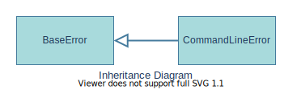

# salt::CommandLineError class
##### Defined by "error.h"
```cpp
class CommandLineError;
```


CommandLineError class is a represantation of an error occured when SaltC cannot properly interpret command line options and/or arguments.
<br>

## Member functions
| Method | Description | Member type |
|--------|-------------|------------------|
| `(constructor)` | Constructs the error instance | Public default constructor |
| [`getHelpRecomendation`](getHelpRecommendation.md) | Returns the string recommendation to look into SaltC command line help page. | Public Method |
_______________________________________________________________________________
## Inherited from [`salt::BaseError`](../BaseError/README.md)
| Method | Description | Member type (override) |
|--------|-------------|------------------|
| `(deconstructor)` | Deconstructs the error instance | Public Virtual default deconstructor |
| [`getMessage`](../BaseError/getMessage.md) <sub><sup>[(override)](getMessage.md)</sup></sub> | Returns the error message | Public Pure virtual method (Public Virtual method) |
<br>

## Example of use
That example prints out the error message about a command line interpretation problem.
```cpp
eprint(CommandLineError);
```
<br>

## See also:
+ [SaltC errors](../README.md)
+ [`salt::BaseError` class](../BaseError/README.md)
+ [`eprint` logging module macro](<eprint-link-placeholder>)