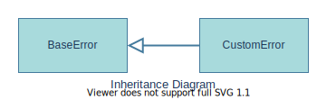

# salt::CustomError class
##### Defined by "error.h" 
```cpp
class CustomError;
```


CustomError class is a represantation of an any error with custom message given via [`constructor`](constructor.md).
<br>

## Member functions
| Method | Description | Member type |
|--------|-------------|------------------|
| [`(constructor)`](constructor.md) | Constructs the error instance | Public constructor |
_______________________________________________________________________________
## Inherited from [`salt::BaseError`](../BaseError/README.md)
| Method | Description | Member type (override) |
|--------|-------------|------------------|
| `(deconstructor)` | Deconstructs the error instance | Public Virtual default deconstructor |
| [`getMessage`](../BaseError/getMessage.md) <sub><sup>[(override)](getMessage.md)</sup></sub> | Returns the error message | Public Pure Virtual method (Public Virtual method) |
<br>

## Example of use
Below example prints out the error with `'An error occurred when xxx in zzz!'` message and exits the program.
```cpp
eprint(CustomError, "An error occurred when xxx in zzz!");
```
<br>

## See also:
+ [SaltC errors](../README.md)
+ [`salt::BaseError` class](../BaseError/README.md)
+ [`eprint` logging module macro](<eprint-link-placeholder>)