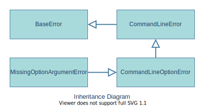

# salt::MissingOptionArgumentError class
##### Defined by "error.h"
```cpp
class MissingOptionArgumentError;
```


MissingOptionArgumentError class is a represantation of an error occured because any command line option which needs an additional argument didn't receive it.
<br>

## Member functions
| Method | Description | Member type |
|--------|-------------|------------------|
| [`(constructor)`](constructor.md) | Constructs the error instance | Public constructor |
_______________________________________________________________________________
## Inherited from [`salt::UnrecognizedOptionError`](../CommandLineError/README.md)
| Method | Description | Member type |
|--------|-------------|------------------|
| `(deconstructor)` | Deconstructs the error instance | Public Virtual default deconstructor |
| [`getMessage`](../BaseError/getMessage.md) <sub><sup>[(override)](getMessage.md)</sup></sub> | Returns the error message | Public Virtual method |
| [`getHelpRecommendation`](../CommandLineError/getHelpRecommendation.md) | Returns the string recommendation to look into SaltC command line help page. | Public method |
| [`getOption`](../CommandLineOptionError/getOption.md) | Returns string command line option for which argument is missing | Public method |
<br>

## Example of use
That example prints out the error message about missing argument for `--output` command line option.
```cpp
eprint(MissingOptionArgumentError, "--output");
```
<br>

## See also:
+ [SaltC errors](../README.md)
+ [`salt::CommandLineError` class](../CommandLineError/README.md)
+ [`eprint` logging module macro](<eprint-link-placeholder>)