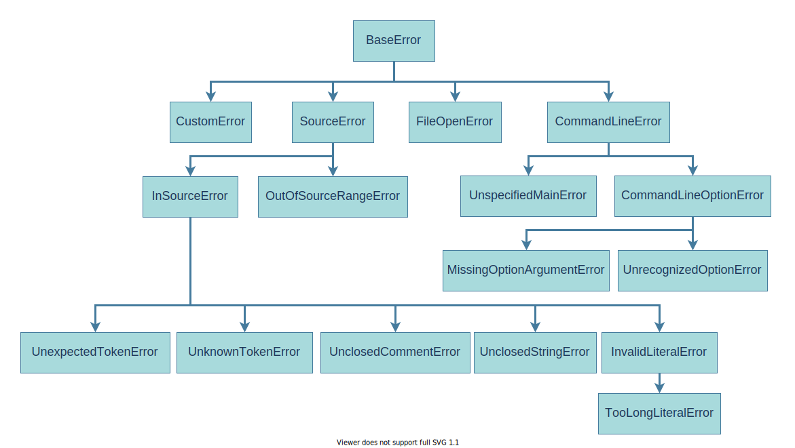

# SaltC errors
##### Implemented by "error.h" 

## Basic usage of errors
SaltC errors classes were created to use with [`eprint`](<eprint-link-placeholder>) macro provided by
    [logging module](<logging-module-link-placeholder>) which prints out an error message based on provided parameters and choosen class of error and than closing compiler after it in most safety and easy-to-use possible way.

To use error with logging module you will need to include two saltc header files:
+ [`logging.h`](<logging-module-link-placeholder>)
+ `error.h`

### **Example usage of eprint and any error class.**
```cpp
eprint(new AnyErrorClass(error_parameters...));
```

How you can see it's needed to pass **pointer to error class object** to throw it,
    but it's fully safe because when you calling [`eprint`](<eprint-link-placeholder>) it's cleans that pointer at the moment before closing program.<br>
    So you may not carry about pointer passed to [`eprint`](<eprint-link-placeholder>) and storing it. That's why I used `new` C++ keyword here.


## Error classes


### **Index**
+ [BaseError](./errors/BaseError/README.md)
+ [FileOpenError](./errors/FileOpenError/README.md)
+ [CommandLineError](./errors/CommandLineError/README.md)
+ [UnspecifiedMainError](./errors/UnspecifiedMainError/README.md)
+ [UnrecognizedOptionError](./errors/UnrecognizedOptionError/README.md)
+ [SourceError](./errors/SourceError/README.md)
+ [OutOfSourceRangeError](./errors/OutOfSourceRangeError/README.md)
+ [InSourceError](./errors/InSourceError/README.md)
+ [UnexpectedTokenError](./errors/UnexpectedTokenError/README.md)
+ [UnknownTokenError](./errors/UnknownTokenError/README.md)
+ [UnclosedCommentError](./errors/UnclosedCommentError/README.md)
+ [UnclosedStringError](./errors/UnclosedStringError/README.md)
+ [InvalidLiteralError](./errors/InvalidLiteralError/README.md)
+ [TooLongLiteralError](./errors/TooLongLiteralError/README.md)
