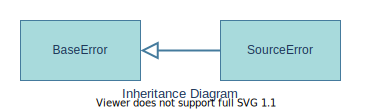

# salt::SourceError class
##### Defined by "error.h"
```cpp
class SourceError;
```


SourceError class is a represantation of an error occured for non specified reason during interacting with the [`Salt source file`](<source-file-link-placeholder>) given via [`constructor`](constructor.md).
<br>

## Member functions
| Method | Description | Member type |
|--------|-------------|------------------|
| [`(constructor)`](constructor.md) | Constructs the error instance | Public constructor |
| [`getSource`](getSource.md) | Returns a pointer to the Salt source file object affected by this error | Public method |
_______________________________________________________________________________
## Inherited from [`salt::BaseError`](../BaseError/README.md)
| Method | Description | Member type |
|--------|-------------|------------------|
| `(deconstructor)` | Deconstructs the error instance | Public Virtual default deconstructor |
| [`getMessage`](../BaseError/getMessage.md) <sub><sup>[(override)](getMessage.md)</sup></sub> | Returns the error message | Public Pure Virtual method |
<br>

## Example of use
That example prints out the error message with path of specified Salt source file.
```cpp
salt::SourceFile source("path/to/salt/file.salt");
eprint(SourceError, source);
```
<br>

## See also:
+ [SaltC errors](../README.md)
+ [`salt::BaseError` class](../BaseError/README.md)
+ [`eprint` logging module macro](<eprint-link-placeholder>)