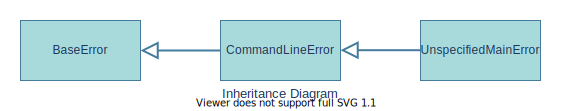

# salt::UnspecifiedMainError class
```cpp
class UnspecifiedMainError;
```


UnspecifiedMainError class is a represantation of an error occured because main source file was not specified via command line argument.
<br>

## Member functions
| Method | Description | Member type |
|--------|-------------|------------------|
| [`(constructor)`](constructor.md) | Constructs the error instance | Public default constructor |
## Inherited from [`salt::CommandLineError`](../CommandLineError/README.md)
| Method | Description | Member type |
|--------|-------------|------------------|
| `(deconstructor)` | Deconstructs the error instance | Public Virtual default deconstructor |
| [`getMessage`](getMessage.md) <sub><sup>(overridden)</sup></sub> | Returns the error message | Public Method |
| [`getHelpRecommendation`](../CommandLineError/getHelpRecommendation.md) | Returns the string recommendation to look into SaltC command line help page. | Public Method |
<br>

## Example of use
That example prints out the error message about not passed main source file path into command line.
```cpp
eprint(new salt::UnspecifiedMainError());
```
<br>

## See also:
+ [SaltC errors](../README.md)
+ [`salt::CommandLineError` class](../CommandLineError/README.md)
+ [`eprint` logging module macro](<eprint-link-placeholder>)